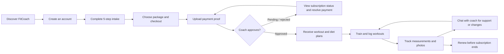
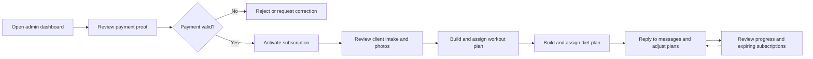
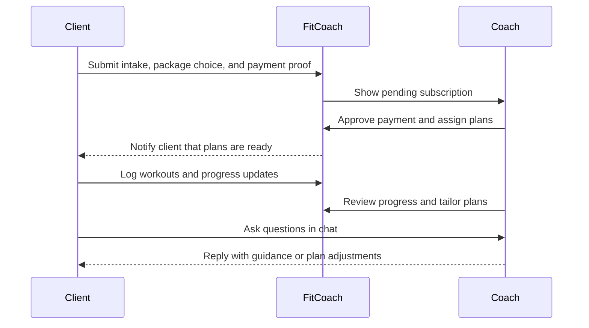

# FitCoach

FitCoach is an online fitness coaching platform. Clients get a personalized workout, diet, and accountability loop. Coaches (admin) run the business: packages, payments, plans, and messaging.

The frontend is a Next.js app. It talks to the FitCoach API at `NEXT_PUBLIC_API_URL` (default `http://localhost:5000/api/v1`).

---

## Getting started

```bash
npm install
npm run dev
```

Open [http://localhost:3000](http://localhost:3000).

Optional: set `NEXT_PUBLIC_API_URL` in `.env.local` if the API is not on localhost:5000.

| Script | What it does |
| --- | --- |
| `npm run dev` | Development server |
| `npm run build` | Production build |
| `npm start` | Serve the production build |
| `npm run lint` | ESLint |

---

## Roles

| Role | Who | App surface |
| --- | --- | --- |
| **Client** | Trainee / subscriber | Marketing site, account, profile, progress, logs, chat |
| **Coach** | Admin / trainer | `/admin` dashboard |

English and Arabic are supported via `next-intl`.

---

## Client features

### Discover (no account required)

- **Home** — coaching process, features, stats, results, testimonials, plans, FAQ
- **Exercise library** (`/exercises`) — search and filter by body part / equipment, GIFs and instructions
- **Calorie calculator** (`/calories`) — Mifflin–St Jeor BMR/TDEE and macros (metric or imperial)
- **AI chatbot** — floating assistant for training, nutrition, and product questions
- **Language switcher** — English / Arabic

### Account

- **Register** — name, email, phone, password, terms
- **Login** — email or phone
- **Profile** (`/profile`) — identity, subscription status, intake photos, assigned workout and diet, PDF download for both plans

### Onboarding and payment

- **Get started** (`/get-started`) — 5-step intake:
  1. Goal (fat loss, muscle, endurance, athletic, health, competition)
  2. Body stats (height, current / target weight, age)
  3. Training (days per week, experience)
  4. Health (injuries, food preferences)
  5. Progress photos
- **Checkout** (`/checkout`) — pick a package duration, apply a coupon, choose Instapay / Vodafone Cash / bank transfer, upload payment proof

### Coaching (after an active subscription)

- **Workout plan** — day-by-day exercises with sets, reps, rest; download as PDF
- **Diet plan** — meals, calories, protein / carbs / fats; download as PDF
- **Progress** (`/progress`) — weight, body fat, chest / waist / bicep, photos, charts, before/after slider
- **Workout log** (`/workout-log`) — log a planned day with sets, weight, mood, duration, notes; weekly / monthly / all-time volume and streaks
- **Chat** (`/chat`) — live 1:1 messages with the coach
- **Notifications** — workout, diet, subscription, and general alerts

---

## Coach features (admin)

All coach tools live under `/admin`.

| Area | What the coach can do |
| --- | --- |
| **Dashboard** | Revenue, active trainees, pending approvals, subscriptions expiring in 7 days, revenue chart, recent activity |
| **Trainees** | Search clients, open intake (goals, stats, injuries, diet prefs, photos), delete a client |
| **Subscriptions** | Review payment proof, approve or reject, filter pending / active / rejected / expired, export |
| **Packages** | Create coaching packages with name, description bullets, and duration/price options |
| **Coupons** | Create percent-off codes with expiry, copy, edit, disable, delete |
| **Workout builder** | Build a multi-day program, pick exercises, sets / reps / rest, assign to a trainee |
| **Workout plans** | List, edit, and manage assigned programs |
| **Diet builder** | Build meals and items with calories and macros, assign to a trainee |
| **Diet Plans** | List and manage assigned nutrition plans |
| **Exercises** | Browse the exercise catalog by muscle and equipment (used when building programs) |
| **Messages** | Inbox of all client conversations, real-time replies |
| **Settings** | Admin profile, notification toggles, security placeholders |

---

## Coaching workflow diagrams

### Client journey



### Coach workflow



### Shared coaching loop



---

## Client story — Layla wants to lose fat

Layla finds FitCoach on her phone. She reads how coaching works: pick a plan, pay, fill an assessment, receive a program. She tries the calorie calculator, then browses the exercise library so she knows what training looks like.

She creates an account, then completes **Get started**:

- Goal: lose fat  
- Body: 165 cm, 78 kg, target 68 kg, age 29  
- Training: 4 days/week, beginner  
- Health: sore knees, high-protein preference  
- Photos: front and side

She chooses the 3-month Transform package, applies a coupon at checkout, pays with Instapay, and uploads the receipt. Until the coach approves payment, her profile shows a pending subscription.

When the coach activates her, she gets a notification. On **Profile** she opens her workout (4 training days) and diet (calorie and macro targets). She downloads both as PDFs for the gym.

Week by week she:

1. Logs each session in **Workout log** (weights, mood, how long it took)
2. Adds **Progress** entries (weight, waist, a photo)
3. Messages her coach in **Chat** when a movement hurts her knees
4. Uses the AI chatbot for simple food swaps

After eight weeks the before/after slider on Progress shows the change. Her subscription end date is on Profile so she can renew before it expires.

---

## Coach story — Karim runs the coaching desk

Karim logs in as admin and lands on the **Dashboard**. He sees three pending payments and two subscriptions ending this week.

He opens **Subscriptions**, inspects Layla’s Instapay screenshot, and **approves** her. He then opens **Trainees**, reads her intake (fat loss, beginner, knee issues, photos) and notes 4 days per week.

In **Workout builder** he assigns Layla a 4-day plan: squat variations that spare her knees, upper-body work, and walking. He saves it. In **Diet builder** he assigns a high-protein meal plan at her calorie target.

Layla is notified. Later she asks in **Messages** whether to swap lunges. Karim replies in the same thread.

On a typical day Karim also:

- Creates a summer coupon in **Coupons**
- Adds a 6-month price option to a package in **Packages**
- Checks **Workout plans** and **Diet plans** for everyone still active
- Uses dashboard **Expiring soon** to message clients who should renew

His loop is: approve money → read the person → assign training and food → stay in chat → watch who needs renewal.

---

## How the two stories meet

```
Client                         Coach
  |                              |
  |  Register + intake           |
  |  Pay + upload proof -------->|  Review proof
  |                              |  Approve subscription
  |  Notification <--------------|  Build workout + diet
  |  Train, log, track           |
  |  Chat / questions ---------->|  Reply, adjust plans
  |  Progress photos/metrics --->|  Review trainee profile
  |  Renew when plan ends <------|  See expiring soon
```

---

## App routes

### Public and client

| Path | Audience |
| --- | --- |
| `/` | Everyone |
| `/login`, `/register` | Guests |
| `/exercises`, `/calories` | Everyone |
| `/get-started` | New clients |
| `/checkout` | Clients buying a package |
| `/profile` | Logged-in client |
| `/progress`, `/workout-log`, `/chat` | Logged-in client |

### Coach

| Path | Area |
| --- | --- |
| `/admin` | Dashboard |
| `/admin/trainees` | Clients |
| `/admin/subscriptions` | Payments |
| `/admin/packages` | Offers |
| `/admin/coupons` | Discounts |
| `/admin/workout-builder`, `/admin/workout-plans` | Training |
| `/admin/diet-builder`, `/admin/diet-plans` | Nutrition |
| `/admin/exercises` | Exercise catalog |
| `/admin/chat` | Messages |
| `/admin/settings` | Admin settings |

---

## Tech stack

- **Next.js 16** (App Router) and **React 19**
- **Redux Toolkit** for auth, packages, coupons
- **Axios** + cookie auth against the REST API
- **Socket.IO** for live chat
- **next-intl** (EN / AR)
- **Tailwind CSS 4**, Motion, GSAP, Recharts, `@react-pdf/renderer`
